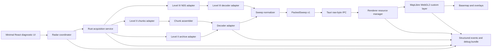
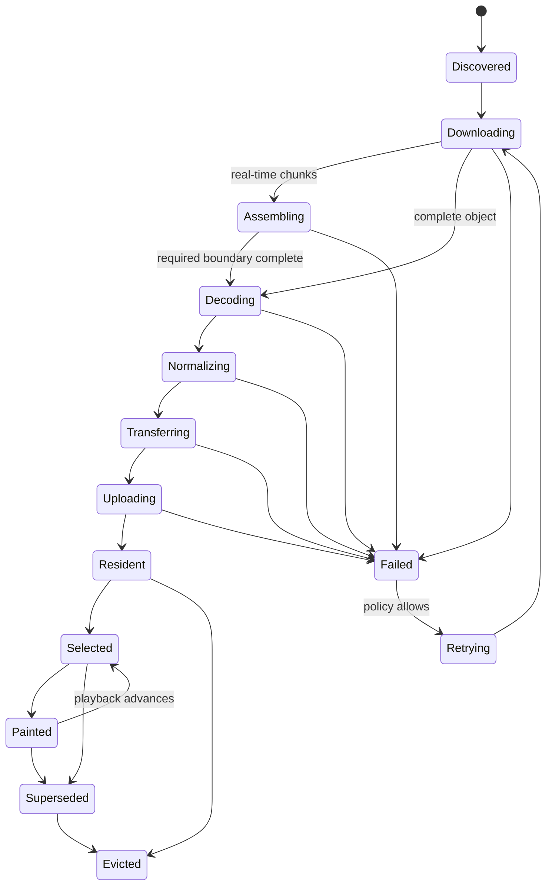

# Mistr Architecture

## 1. Architecture principles

1. **Bound the experiment.** Mistr replaces only selected-site radar transport and rendering.
2. **One authoritative state machine.** UI components display state; they do not infer data readiness.
3. **No radar tiles in the selected-site hot path.** Radar observations are decoded datasets, not MapLibre raster sources.
4. **No bulk JSON.** Large numeric data crosses the Tauri boundary as packed bytes.
5. **Prepare once, replay cheaply.** Network, decode, normalization, and upload occur before a frame becomes resident.
6. **Measured observations only.** Hard cuts are the default. Any interpolation must be explicitly labeled and never change stored values.
7. **Resource ownership is explicit.** Every task, buffer, texture, event listener, and cancellation token has one owner and one release path.
8. **Dev and packaged use the same contract.** Fixtures may replace the network, but they do not replace the decoder, wire format, renderer, or state machine.
9. **Fallback is a first-class state.** The old tile path remains available during GustAVO integration.

## 2. Top-level design



## 3. Process and thread model

### 3.1 Rust process

The Tauri process owns network access, chunk assembly, decoding, normalization, disk cache, hashes, and fixture capture.

Rules:

- No download, decompression, volume assembly, parsing, normalization, hashing, or disk scan may execute on the Windows UI/IPC handler thread.
- Async network work runs on Tokio.
- Blocking decompression/decoding and large disk operations run on a bounded blocking pool.
- Work is cancellable by request generation and radar-site generation.
- Completed work may publish only if its generation is still current.
- The number of simultaneous volume decodes, chunk downloads, and disk writes is bounded and reported.

### 3.2 WebView renderer process

The renderer owns:

- React controls and diagnostics.
- The authoritative frontend mirror of the radar state machine.
- Parsing the small header of `PackedSweep v1`.
- Typed-array views over received bytes.
- MapLibre custom-layer registration.
- WebGL resource creation, selection, draw, and release.
- Animation timing for playback or optional visual crossfade.

Large data should not be copied through React or Zustand. Store identifiers and small metadata in UI state; keep typed arrays and GPU handles in a dedicated resource manager.

### 3.3 No renderer network path

The prototype should not have separate browser and packaged provider implementations. Network acquisition always goes through Rust. Deterministic development uses fixture-backed Rust acquisition, not a second JavaScript download path.

## 4. Component responsibilities

### `RadarCoordinator`

- Accept site/product/time-window intent.
- Increment a generation on site, product, or request-window change.
- Cancel work owned by the previous generation.
- Request inventory and frames.
- Enforce the state machine and loop policy.
- Publish only metadata and identifiers to React.

### `AcquisitionService`

- List public S3 objects without credentials.
- Retrieve completed Level II volumes.
- Discover and poll current rotating chunk volumes.
- Retrieve Level III products required for parity.
- Apply deadlines, retries with jitter, response-size ceilings, host allowlists, and cancellation.
- Emit timing and byte-count evidence.

### `ChunkAssembler`

- Recognize volume start, intermediate, and end chunks.
- Enforce site, volume, sequence, and timestamp consistency.
- Detect gaps, duplicates, late arrivals, rollover, and incomplete termination.
- Never label an incomplete volume complete.
- Allow a complete lowest sweep to be published only if the decoder proves its end-of-elevation boundary and the product policy permits progressive display.

### `DecoderAdapter`

- Hide the selected third-party decoder behind Mistr-owned interfaces.
- Convert parser-specific structures to an internal radar model.
- Preserve raw codes, scale, offset, missing/range-folded values, azimuth, elevation, gate spacing, first-gate range, radar location, scan time, and VCP metadata.
- Reject unsupported or internally inconsistent structures loudly.
- Return structured error categories rather than raw parser strings.

### `SweepNormalizer`

- Select the requested moment and elevation.
- Normalize variable radar layouts into a documented GPU-friendly representation.
- Preserve a validity mask and distinguish missing, below-threshold, and range-folded values.
- Never silently resample or smooth without an explicit mode recorded in metadata.
- Calculate content hashes for cache and comparison.

### `WireEncoder`

- Encode `PackedSweep v1` as a small fixed header plus aligned binary sections.
- Include total length and per-section offsets/lengths.
- Use fixed endianness.
- Include schema version, product identity, units, scale/offset, dimensions, site, time, elevation, range geometry, flags, and integrity hash.
- Reject any buffer whose declared regions overlap or exceed total length.

### `RadarResourceManager`

- Own CPU typed-array views until upload completes.
- Own one bounded GPU loop per site/product/elevation key.
- Map observation IDs to array-layer indices or texture handles.
- Enforce a hard loop-size and byte budget.
- Replace resources atomically: allocate and verify the new set before releasing the visible old set.
- Release resources on eviction, generation change, layer removal, and context loss.

### `RawRadarLayer`

- Implement the MapLibre custom-layer contract.
- Draw radar below labels and above appropriate underlays.
- Save/restore every GL state it mutates or explicitly set all required state.
- Use premultiplied alpha compatible with MapLibre's blend expectations.
- Render only resident frames.
- Expose a paint receipt containing generation, observation ID, GL context epoch, and render sequence.
- Rebuild from retained normalized CPU data or request replay after context restoration.

## 5. Authoritative radar state machine



### State rules

- `Resident` means all required GPU resources exist for the current WebGL context epoch.
- `Selected` means the render selector references the observation.
- `Painted` requires a receipt from an actual custom-layer render call after selection.
- UI playhead time follows `Painted`, not request intent.
- A frame from an old generation can never transition to `Selected` or `Painted`.
- `contextlost` invalidates every `Resident` state immediately.
- `contextrestored` creates a new context epoch; old GL handles are never reused.
- Network freshness and paint readiness are separate values.

## 6. Loop model

The initial loop contains at most 20 measured observations for one key:

```text
site + product + elevation + normalization mode + wire schema
```

Rules:

- Observations are ordered by radar measurement time, not download completion time.
- Duplicate measurement times are deduplicated by content hash and source preference.
- The newest frame receives an optional longer dwell, matching the operational preference in GustAVO.
- If the next observation is not resident, the visible observation remains unchanged and the UI says why.
- Playback never jumps to an intended timestamp that has not painted.
- Hard cut is the correctness baseline.
- Crossfade, if tested, blends visual output only; observation timestamps remain discrete.

## 7. IPC contract

### 7.1 Control IPC

Small JSON messages may carry:

- Start/cancel requests.
- Site/product/time-window selection.
- Inventory metadata.
- Progress and structured errors.
- Resource-release acknowledgements.

### 7.2 Data IPC

Decoded sweep data uses Tauri's raw byte response/channel representation. It must not serialize millions of gate values as JSON arrays.

One response should contain one sweep unless measurement proves batching is better. Each response includes a generation and observation ID in its binary header and an accompanying small control envelope.

### 7.3 Backpressure

- The renderer grants a bounded number of upload credits.
- Rust does not send an unbounded stream of complete sweeps.
- The next sweep is transferred only when a credit is available.
- Cancellation revokes outstanding credits for the prior generation.
- Metrics expose queued bytes on both sides.

## 8. Selected-site and national radar coexistence

Mistr does not build a national mosaic.

For eventual GustAVO integration:

- Below the established handoff zoom, the existing national mosaic remains authoritative.
- At and above the handoff zoom, the raw selected-site layer becomes authoritative when healthy and resident.
- A raw-layer failure may fall back to tiled selected-site radar with an explicit source/status change.
- Products with different valid times are not blended as if simultaneous.
- Handoff tests must cover both camera movement and timeline transitions.

## 9. Cache architecture

Separate three concerns:

1. **Raw object cache:** immutable downloaded Level II/III objects keyed by bucket/key plus content metadata.
2. **Normalized sweep cache:** Mistr-owned `PackedSweep` files keyed by source hash, product, elevation, normalization version, and schema.
3. **GPU loop cache:** process-lifetime resources bounded by loop size and GPU bytes.

The prototype must not reuse GustAVO's PNG tile cache.

Cache entries require:

- Canonical names generated internally.
- Maximum object sizes.
- Atomic writes.
- Version and checksum validation on startup and read.
- Bounded/coalesced disk writers.
- Deterministic eviction ownership.
- Rebuild-on-corruption behavior.

## 10. Error model

Every surfaced error has:

- Stable code.
- Stage.
- Site/product/observation when applicable.
- Retryable boolean.
- User-safe summary.
- Internal diagnostic details kept in the debug bundle.
- Cause chain without credentials or arbitrary response bodies.

Minimum categories:

- `inventory_unavailable`
- `object_timeout`
- `object_too_large`
- `chunk_gap`
- `chunk_sequence_invalid`
- `volume_incomplete`
- `decoder_unsupported`
- `decoder_inconsistent`
- `normalization_failed`
- `wire_invalid`
- `ipc_cancelled`
- `gpu_budget_exceeded`
- `gpu_upload_failed`
- `webgl_context_lost`
- `paint_not_observed`
- `fallback_activated`

## 11. Security boundary

- Only exact public AWS radar hosts and explicitly approved reference sources are reachable.
- Callers never provide an arbitrary URL to Rust.
- Object keys are validated against the selected site/product and expected format.
- Response sizes and decompressed sizes are bounded.
- Parsed counts and offsets are checked before allocation.
- No AWS credentials are required or accepted for public prototype acquisition.
- Debug bundles redact local paths where practical and never contain secrets.

## 12. Architectural adoption bar

The architecture is adoptable only if it is demonstrably smaller and more deterministic than the selected-site tile machinery it replaces. Line count alone is irrelevant. The deciding evidence is:

- Fewer runtime states coupled to MapLibre internals.
- Reproducible failures using pinned binary fixtures.
- Bounded resource ownership.
- Stable packaged behavior.
- A debug record that can explain every visible frame.
