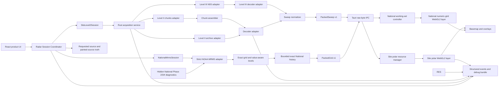
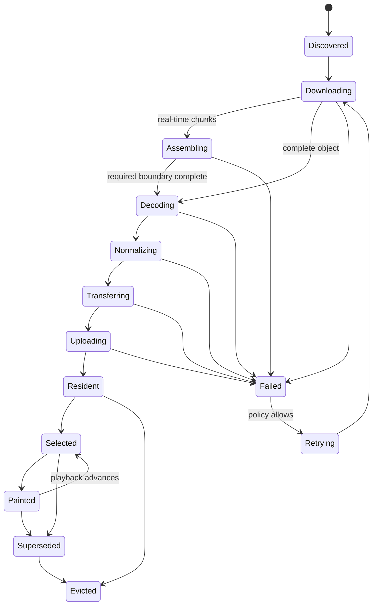

# Mistr Architecture

## 1. Architecture principles

1. **Bound each source.** Site remains the qualified polar engine. National retains at most 20 exact NOAA MRMS observations through a separate session and gridded renderer rather than changing Level II into a mosaic engine.
2. **One authoritative state machine.** UI components display state; they do not infer data readiness.
3. **No radar tiles in the selected-site hot path.** Radar observations are decoded datasets, not MapLibre raster sources.
4. **No bulk JSON.** Large numeric data crosses the Tauri boundary as packed bytes.
5. **Prepare once, replay cheaply.** Network, decode, normalization, and upload occur before a frame becomes resident.
6. **Measured observations only.** Hard cuts are the default. Any interpolation must be explicitly labeled and never change stored values.
7. **Resource ownership is explicit.** Every task, buffer, texture, event listener, and cancellation token has one owner and one release path.
8. **Dev and packaged use the same contract.** Fixtures may replace the network, but they do not replace the decoder, wire format, renderer, or state machine.
9. **Fallback is a first-class state.** A failed or superseded source transition preserves the last authoritative painted observation.

## 2. Top-level design



## 3. Process and thread model

### 3.1 Rust process

The Tauri process owns network access, chunk assembly, decoding, normalization, directly indexed memory caches, hashes, and fixture capture. Merged Phase 2 supplies the fixed-host MRMS adapter, strict GRIB2 Template 5.41/PNG decoder, exact raw-code grid, numeric overview pyramid, and `PackedGrid v1` encoder. Phase 4 retains immutable compressed observations and complete factor-4 overview frames chronologically while exact point interrogation re-decodes only the painted retained identity under a one-operation gate. The frontend also permits only one lookup call at a time and replaces any waiting request with the newest painted receipt, so playback cannot build a stale decode queue behind that gate.

Rules:

- No download, decompression, volume assembly, parsing, normalization, hashing, or disk scan may execute on the Windows UI/IPC handler thread.
- Async network work runs on Tokio.
- Blocking decompression/decoding and large disk operations run on a bounded blocking pool.
- Work is cancellable by request generation and radar-site generation.
- Completed work may publish only if its generation is still current.
- The number of simultaneous volume decodes, chunk downloads, and disk writes is bounded and reported.

### 3.2 WebView renderer process

The renderer owns:

- React controls and diagnostics.
- The authoritative frontend mirror of the radar state machine.
- Parsing the small header of `PackedSweep v1`.
- Parsing bounded `PackedGrid v1` manifests and individual numeric chunks for the National history working set.
- Typed-array views over received bytes.
- MapLibre custom-layer registration.
- WebGL resource creation, selection, draw, and release.
- Animation timing for playback or optional visual crossfade.

Large data should not be copied through React or Zustand. Store identifiers and small metadata in UI state; keep typed arrays and GPU handles in a dedicated resource manager.

### 3.3 No renderer network path

The prototype should not have separate browser and packaged provider implementations. Network acquisition always goes through Rust. Deterministic development uses fixture-backed Rust acquisition, not a second JavaScript download path.

## 4. Component responsibilities

### `RadarSessionCoordinator`

- Accept typed source intent through `RadarSourceKey`: `{ kind: "site", siteIcao }` or the future `{ kind: "national", domain: "conus" }`.
- Keep requested-source intent separate from the last source proven by a GPU paint receipt.
- Allocate monotonically increasing source-transition generations and supersede older requests.
- Accept a transition only when source, generation, and observation identity match the current authoritative receipt.
- Preserve painted-source truth on cancellation or failure.
- Persist an intentional source choice only after matching paint acceptance; diagnostic transitions never persist.
- Publish small source-state snapshots to React while leaving bulk data outside UI state.

### `SiteLevel2Session`

- Adapt the current selected-site Level II engine to the shared source coordinator.
- Preserve current acquisition, decoder, rolling-history, two-credit IPC, renderer, playback, and recovery behavior.
- Pass the coordinator-assigned transition generation through acquisition and GPU replacement.
- Return the final paint identity for coordinator acceptance.
- Reject a completion when a newer Site or National request has superseded it.

Phase 1 implemented these two components. Merged Phase 3 places `NationalMrmsSession` behind the same coordinator without changing the Site engine; Phase 4 extends only that session's source-specific history.

### Merged Phase 2 MRMS and `PackedGrid v1` path

- `MrmsClient` allows only anonymous HTTPS to `noaa-mrms-pds.s3.amazonaws.com`, lists bounded exact current/previous UTC-day prefixes, sorts by measured observation time, and downloads only validated `MergedBaseReflectivityQC_00.50` keys.
- The decoder bounds compressed, expanded GRIB, PNG, and normalized bytes; rejects markup returned with HTTP 200; pins the reviewed discipline, identification, grid, product, packing, bitmap, orientation, bit depth, scaling, and status contract; and preserves every structurally valid 16-bit raw code.
- `MrmsNumericPyramid` builds power-of-two levels with strongest-valid, then missing, then no-coverage reduction. It never averages numeric/status codes.
- `PackedGrid v1` carries one complete bounded frame manifest plus bounded big-endian numeric chunks with generation, source identity, measured time, content hash, transform, encoding, presentation level, chunk geometry, halo bounds, length, and payload hash.
- `NationalPhase2State` remains the Phase 2 diagnostic cache. Product history is owned separately by `NationalHistoryState`, which retains immutable compressed objects plus complete factor-4 `PackedGrid` overviews under a 20-frame/180 MiB contract and exposes only one bounded fine-presentation cache.
- National manifests and chunks acquire credits from the existing `TransferBroker`; there is no second credit pool. Partial, stale, or invalid payload work releases its ownership and never changes paint truth.

### Phase 3 static National renderer path

- `NationalMrmsSession` begins a typed `{ kind: "national", domain: "conus" }` transition and commits only the matching complete renderer receipt.
- `NationalWorkingSetController` chooses a complete factor-4 domain overview or factor-1 camera viewport, validates every required descriptor, owns one chunk lease through upload, and rolls back incomplete mutation.
- `NationalGridLayer` owns separate active/staged presentations, `R16UI` numeric textures, the reflectivity palette, spatial sampling shaders, coverage identity, GPU fences, and visible-first context rehydration.
- The old Site layer remains enabled until National has acquired, decoded, transferred, and uploaded every required chunk. Immediately before the first complete National draw, Site is disabled; acceptance then releases the Site loop. The inverse transition follows the same atomic rule. If a Site attempt has already advanced the shared transfer generation and stopped National history but then fails before acceptance, `SiteLevel2Session` reports that current failure after coordinator rollback and Mistr starts a newer National generation while the old complete National paint remains visible.
- Exact inspection asks Rust for the retained base cell using the painted generation, observation time, content hash, and a unique inspection identity. Late or cross-source replies are ignored. At most one native lookup is active; a single latest-only pending slot coalesces faster playback cuts.

### Phase 4 bounded National history path

- `NationalHistoryState` stages one `current`, `predecessor`, or `newer` observation at a time, validates strict chronology and exact identity, commits only after a complete GPU fence receipt, and evicts at most one oldest observation above the configured limit.
- `NationalHistoryWorkingSetController` keeps a complete factor-4 domain presentation for every retained observation. Manifest/chunk leases still come from the sole two-credit broker. The renderer divides each texture into bounded row bands and uploads those bands over animation frames, with every measured slice limited to at most 4 ms.
- `NationalGridLayer` indexes common/detail resources by observation identity, tracks retained versus resident versus painted truth, and measures all resident, staged, and transaction-retired GPU resources against the 200 MiB target and 256 MiB ceiling.
- History mutations are provisional after their GPU fence. The renderer retains the prior resource graph while Rust applies the chronology change with a bounded reversible commit journal. Renderer finalization then permits Rust to seal that journal; context loss, supersession, or failure before finalization restores both the prior GPU graph and the exact backend chronology. Rust retains the last sealed identity so a duplicate finalization caused by a lost IPC response succeeds idempotently instead of stranding the already-finalized renderer. After sealing, publication revalidates the complete presentation identity against the renderer's current authoritative receipt, waiting through any intervening context epoch instead of passing a pre-loss receipt to playback.
- `NationalPlaybackController` selects only resident factor-4 presentations during play and active scrub. Polling/backfill are suspended while resident-only activity owns the hot path, so selection performs no network, decode, IPC, or upload work.
- Paused/settled high-zoom selection may stage an exact factor-1 viewport plus a bounded adjacent temporal window. Fine detail never changes timeline, measured time, age, source, or interrogation identity, and cannot replace individual playback frames while the quality lock is active.
- Context recovery rehydrates the visible presentation first and then every common resident from retained CPU bytes. It does not request the network or rebuild source history.

### `AcquisitionService`

- List public S3 objects without credentials.
- Retrieve completed Level II volumes.
- Discover and poll current rotating chunk volumes.
- Retrieve Level III products required for parity.
- Apply deadlines, retries with jitter, response-size ceilings, host allowlists, and cancellation.
- Emit timing and byte-count evidence.

### `ChunkAssembler`

- Recognize volume start, intermediate, and end chunks.
- Enforce site, volume, sequence, and timestamp consistency.
- Detect gaps, duplicates, late arrivals, rollover, and incomplete termination.
- Never label an incomplete volume complete.
- Allow a complete lowest sweep to be published only if the decoder proves its end-of-elevation boundary and the product policy permits progressive display.

### `DecoderAdapter`

- Hide the selected third-party decoder behind Mistr-owned interfaces.
- Convert parser-specific structures to an internal radar model.
- Preserve raw codes, scale, offset, missing/range-folded values, azimuth, elevation, gate spacing, first-gate range, radar location, scan time, and VCP metadata.
- Reject unsupported or internally inconsistent structures loudly.
- Return structured error categories rather than raw parser strings.

### `SweepNormalizer`

- Select the requested moment and elevation.
- Normalize variable radar layouts into a documented GPU-friendly representation.
- Preserve a validity mask and distinguish missing, below-threshold, and range-folded values.
- Never silently resample or smooth without an explicit mode recorded in metadata.
- Calculate content hashes for cache and comparison.

### `WireEncoder`

- Encode `PackedSweep v1` as a small fixed header plus aligned binary sections.
- Include total length and per-section offsets/lengths.
- Use fixed endianness.
- Include schema version, product identity, units, scale/offset, dimensions, site, time, elevation, range geometry, flags, and integrity hash.
- Reject any buffer whose declared regions overlap or exceed total length.

### `RadarResourceManager`

- Own CPU typed-array views until upload completes.
- Own one bounded GPU loop per site/product/elevation key.
- Map observation IDs to array-layer indices or texture handles.
- Enforce a hard loop-size and byte budget.
- Replace resources atomically: allocate and verify the new set before releasing the visible old set.
- Release resources on eviction, generation change, layer removal, and context loss.

### `RawRadarLayer`

- Implement the MapLibre custom-layer contract.
- Draw radar below labels and above appropriate underlays.
- Save/restore every GL state it mutates or explicitly set all required state.
- Use premultiplied alpha compatible with MapLibre's blend expectations.
- Render only resident frames.
- Expose a paint receipt containing generation, observation ID, GL context epoch, and render sequence.
- Rebuild from retained normalized CPU data or request replay after context restoration.

## 5. Authoritative radar state machine



### State rules

- `Resident` means all required GPU resources exist for the current WebGL context epoch.
- `Selected` means the render selector references the observation.
- `Painted` requires a receipt from an actual custom-layer render call after selection.
- UI playhead time follows `Painted`, not request intent.
- A frame from an old generation can never transition to `Selected` or `Painted`.
- `contextlost` invalidates every `Resident` state immediately.
- `contextrestored` creates a new context epoch; old GL handles are never reused.
- Network freshness and paint readiness are separate values.

## 6. Loop model

The initial loop contains at most 20 measured observations for one key:

```text
site + product + elevation + normalization mode + wire schema
```

Rules:

- Observations are ordered by radar measurement time, not download completion time.
- Duplicate measurement times are deduplicated by content hash and source preference.
- The newest frame receives an optional longer dwell, matching the operational preference in GustAVO.
- If the next observation is not resident, the visible observation remains unchanged and the UI says why.
- Playback never jumps to an intended timestamp that has not painted.
- Hard cut is the correctness baseline.
- Crossfade, if tested, blends visual output only; observation timestamps remain discrete.

## 7. IPC contract

### 7.1 Control IPC

Small JSON messages may carry:

- Start/cancel requests.
- Site/product/time-window selection.
- Inventory metadata.
- Progress and structured errors.
- Resource-release acknowledgements.

### 7.2 Data IPC

Decoded sweep data uses Tauri's raw byte response/channel representation. It must not serialize millions of gate values as JSON arrays.

One response should contain one sweep unless measurement proves batching is better. Each response includes a generation and observation ID in its binary header and an accompanying small control envelope.

National uses a separate `PackedGrid v1` schema because a rectilinear 7,000 by 3,500 numeric grid is not a polar sweep. The full expanded grid never crosses IPC as one frontend buffer. One manifest and one bounded chunk cross per lease, with complete generation/observation/content identity repeated and checked on both Rust and TypeScript sides.

### 7.3 Backpressure

- The renderer grants a bounded number of upload credits; the hard limit is exactly two globally across Site sweeps and National manifests/chunks.
- Rust does not send an unbounded stream of complete sweeps.
- The next sweep is transferred only when a credit is available.
- Cancellation revokes outstanding credits for the prior generation.
- Metrics expose queued bytes on both sides.

## 8. Selected-site and National source sessions

Mistr does not build a national mosaic from Level II sites and never switches sources automatically based on zoom.

The approved model is one coordinator with exactly one active source generation and one painted source truth:

- `SiteLevel2Session` owns the currently implemented per-site Level II path.
- `NationalMrmsSession` owns the explicit CONUS path. On the Phase 4 branch it paints current first, backfills up to 19 predecessors, then polls inventory for strictly newer observations.
- Site and National keep independent timelines, but only the painted source exposes one timeline at a time.
- During transition the old source may remain visibly painted, but superseded backfill stops and the replacement does not become UI truth until a complete receipt commits.
- After commit, the old source releases its complete loop; Mistr does not keep two permanent warm radar histories.
- MapLibre source-loaded state, hidden opacity, and tile events are not radar readiness signals.

Merged Phases 1 through 3 establish coordination, data transport, and one complete painted National source. The active Phase 4 branch extends the source-specific timeline and working set without creating a second coordinator or keeping two permanent radar loops.

## 9. Cache architecture

Separate three concerns:

1. **Raw object cache:** immutable downloaded Level II/III objects keyed by bucket/key plus content metadata. National keeps at most 20 exact compressed observations in Rust-owned process memory and does not add a directory-scanned disk cache.
2. **Normalized data cache:** Mistr-owned `PackedSweep` files for Site plus the bounded, directly indexed National factor-4 overviews and one fine-presentation cache.
3. **GPU working set:** the active Site loop or the active National all-frame common level plus selected/adjacent detail, never two permanent histories.

The prototype must not reuse GustAVO's PNG tile cache.

Cache entries require:

- Canonical names generated internally.
- Maximum object sizes.
- Atomic writes.
- Version and checksum validation on startup and read.
- Bounded/coalesced disk writers.
- Deterministic eviction ownership.
- Rebuild-on-corruption behavior.

## 10. Error model

Every surfaced error has:

- Stable code.
- Stage.
- Site/product/observation when applicable.
- Retryable boolean.
- User-safe summary.
- Internal diagnostic details kept in the debug bundle.
- Cause chain without credentials or arbitrary response bodies.

Minimum categories:

- `inventory_unavailable`
- `object_timeout`
- `object_too_large`
- `chunk_gap`
- `chunk_sequence_invalid`
- `volume_incomplete`
- `decoder_unsupported`
- `decoder_inconsistent`
- `normalization_failed`
- `wire_invalid`
- `ipc_cancelled`
- `gpu_budget_exceeded`
- `gpu_upload_failed`
- `webgl_context_lost`
- `paint_not_observed`
- `fallback_activated`

## 11. Security boundary

- Only exact public AWS radar hosts and explicitly approved reference sources are reachable.
- Callers never provide an arbitrary URL to Rust.
- Object keys are validated against the selected site/product and expected format.
- Response sizes and decompressed sizes are bounded.
- Parsed counts and offsets are checked before allocation.
- No AWS credentials are required or accepted for public prototype acquisition.
- Debug bundles redact local paths where practical and never contain secrets.

## 12. Architectural adoption bar

The architecture is adoptable only if it is demonstrably smaller and more deterministic than the selected-site tile machinery it replaces. Line count alone is irrelevant. The deciding evidence is:

- Fewer runtime states coupled to MapLibre internals.
- Reproducible failures using pinned binary fixtures.
- Bounded resource ownership.
- Stable packaged behavior.
- A debug record that can explain every visible frame.
