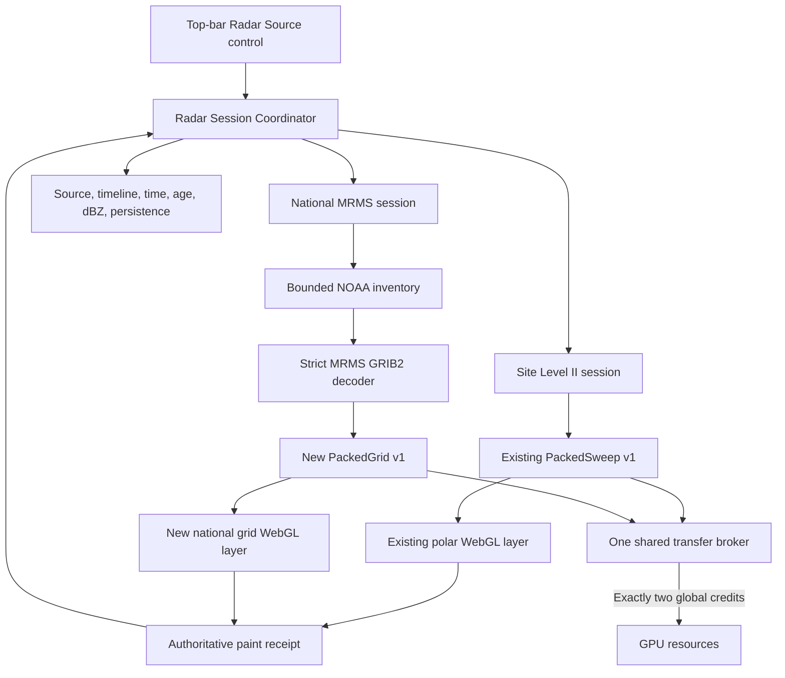

# Mistr National Radar Implementation Plan

| Plan field | Decision |
|---|---|
| Decision date | 2026-08-03 |
| Last plan amendment | 2026-08-03 — 20-observation retained history, level-of-detail GPU working set, theoretical-domain encoding, time-sliced uploads, and cross-source freshness evidence |
| Status | Approved plan; Phases 1 through 3 merged in PRs #15/#16/#17; Phase 4 bounded National history active on `codex/mistr-national-history` for review |
| Planned source | NOAA Multi-Radar/Multi-Sensor System (MRMS) `MergedBaseReflectivityQC` |
| Initial geographic scope | Contiguous United States (CONUS) |
| Initial retained history | 20 exact observations, approximately 38 minutes at the normal two-minute publication cadence |
| Extension contract | The same storage, wire, renderer, and timeline architecture must support a later 30-observation, approximately 58-minute history after measured validation |

## 1. Purpose

This document defines the next Mistr radar milestone: a truthful, bounded National radar mode that preserves the selected-site Level II engine rather than replacing or weakening it.

The plan deliberately avoids the failure modes demonstrated by GustAVO's national/site radar path. National radar will not be assembled from individual Level II sites inside Mistr, represented as a large set of animated MapLibre tile sources, or automatically substituted for site radar at a zoom threshold. It will be a separate NOAA-produced gridded observation type with the same generation, ownership, paint-receipt, playback, recovery, and UI-truth standards already required by Mistr.

This remains the governing phased contract. The owner authorized and merged Phase 1 through PR #15, Phase 2 through PR #16, and Phase 3 through PR #17 at `be4b05b`. The owner separately authorized Phase 4 on 2026-08-03. Phase 4 authorization extends only to bounded rolling National history, polling, all-frame residency, playback/scrubbing quality locking, paused detail refinement, exact retained-frame interrogation, and recovery; it does not authorize the Phase 5 long-session/platform hardening matrix.

## 2. Accepted product decisions

The owner accepted the following decisions on 2026-08-03:

1. **Radar source is chosen explicitly from the top bar.** The two top-level choices are `National` and `Site`. Mistr will not automatically switch sources when the user zooms.
2. **The first National release covers CONUS.** The user-facing choice may remain the simple word `National`, while supporting copy and accessibility text identify the coverage as the contiguous United States. Alaska, Hawaii, the Caribbean, and Guam are separate future regional domains.
3. **The first National loop retains 20 exact observations, approximately 38 minutes.** Retained history and GPU residency are separate contracts: Rust keeps the bounded exact history, while the renderer holds a level-of-detail and viewport-specific working set under the existing 200 MiB GPU target. The architecture must permit a later increase to 30 observations without replacing the wire format, renderer, cache, or timeline model.

These decisions are settled for the planned milestone. Reopening one requires new evidence or an explicit owner change.

## 3. Product contract

### 3.1 What National is

National is NOAA's already-produced, quality-controlled MRMS base-reflectivity mosaic for CONUS. Mistr downloads, validates, decodes, and renders the official gridded observations. Mistr does not claim that it created the mosaic.

The planned product is `MergedBaseReflectivityQC`, not vertical composite reflectivity. It is the closest national MRMS product to Mistr's current base-reflectivity purpose while still being a processed national grid.

National and Site are related but distinct sources:

| Source | Meaning |
|---|---|
| `Site` | One selected NEXRAD station's Level II lowest safe base-reflectivity sweep |
| `National` | NOAA's processed and quality-controlled MRMS CONUS base-reflectivity mosaic |

Their dBZ values are comparable, but the products use different measurement geometry and processing. Pixel-for-pixel agreement is not expected and must not be implied.

### 3.2 Top-bar source selection

The top bar owns one canonical Radar Source control with two top-level choices:

- **National** — contiguous U.S. MRMS mosaic
- **Site** — opens the existing searchable NEXRAD station selection

There will be no duplicate source picker in a menu and no separate National layer toggle. Selecting `Site` exposes the station list inside the same temporary panel ownership model already used by Mistr.

The control's visible and accessible truth follows the source that actually painted, not the user's request. Recommended accessible naming:

- `Radar Source, National, contiguous United States`
- `Radar Source, Site, KTLX`

### 3.3 Source transition behavior

The currently painted radar remains visible while a requested source loads.

Example: KTLX is visible and the user requests National.

1. Mistr begins a newer generation and cancels superseded work.
2. KTLX remains painted and remains the source named by the top bar, timeline, displayed time, age, and dBZ result.
3. An exceptional loading notice may say `Loading National radar` or `Showing KTLX while National radar loads`.
4. Mistr acquires, validates, decodes, transfers, uploads, and draws the newest National observation.
5. Only a matching authoritative GPU paint receipt may commit the transition.
6. The source name, timeline, displayed time, age, inspection value, and persisted startup source change together.
7. The old source resources are released only after the replacement has painted successfully.

If National fails to load, KTLX remains visible and truthful. The inverse rules apply when changing from National to a site.

### 3.4 Timeline and playback

National and Site never share a timeline. The currently painted source alone owns:

- the resident observations;
- play, pause, and direct scrubbing;
- the playhead;
- displayed observation time;
- numeric observation age;
- the green current-frame or white historical-frame age treatment;
- inspected dBZ and no-data status;
- partial-history or acquisition notices.

National retains 20 exact chronological observations. The newest safe observation paints first, and up to 19 predecessors backfill afterward without changing the visible newest observation. The timeline exposes every retained observation, but the renderer uploads only the level-of-detail chunks required for the current camera and playback working set.

The plan uses three terms deliberately:

- **Retained** — the exact observation remains available in the bounded Rust-owned history and appears on the timeline.
- **Resident** — the GPU currently owns every chunk required to paint that observation at the selected camera's required presentation level.
- **Painted** — a complete frame at a declared presentation level produced a matching authoritative receipt. Partially uploaded chunks are never painted-frame truth.

At the normal CONUS overview, all 20 observations must be resident at the selected overview level so play, pause, and direct scrubbing require no network, disk, decode, IPC, or upload work. At high zoom, Mistr keeps one complete common presentation level available for every retained observation and prioritizes finer detail for the selected observation and a bounded temporal window. Playback and active scrubbing use the common complete level so motion and direct selection do not wait for uneven per-frame refinement. Once playback pauses or scrubbing settles, the selected observation may refine to the finest camera-appropriate detail.

MRMS is normally several minutes older than the freshest selected-site Level II observation because NOAA must construct and disseminate the mosaic. Official NWS training material describes typical MRMS latency of roughly two to three minutes, with occasional longer spikes. A switch from Site to National may therefore make the displayed observation time move backward and the numeric age increase even though Mistr has loaded the newest available National observation. Green means newest for the active source; it does not mean that National is as recent as Site. Mistr keeps the numeric time and age truthful without reintroducing `fresh` or `stale` labels.

### 3.5 Rendering and interrogation

The existing `Smooth` and `Native` choices apply to National:

- **Native** shows the exact nearest MRMS grid cell.
- **Smooth** spatially interpolates valid neighboring cells for presentation.

Smooth must not interpolate through missing or no-coverage values, and it must not change the native dBZ value reported by map interrogation. A map click retains the existing small reticle and reports the exact source-native value in the bottom bar. Changing source or observation clears or recomputes the result so stale dBZ is never labeled as current.

Because an overview frame may not carry every base-grid cell in frontend memory, National interrogation uses a bounded Rust-owned point lookup against the exact retained observation. The request and response carry the painted observation, generation, and geographic inspection identity. The UI accepts the value only if all three still match current paint truth; a late lookup from an older frame or source is discarded. Playback may have only one exact lookup active and one latest-only pending receipt, preventing older observation cuts from forming an unbounded decode queue.

Recenter fits the full supported CONUS domain when National is painted and fits measured radar coverage when Site is painted. User pan and zoom remain unrestricted afterward.

## 4. Explicit non-goals

The first National milestone does not include:

- client-side mosaicking of Level II stations;
- automatic National/Site handoff based on zoom or camera position;
- simultaneous visible National and Site radar;
- a background second radar loop kept warm indefinitely;
- national velocity or storm-relative velocity;
- composite reflectivity as a second National product;
- Alaska, Hawaii, Caribbean, or Guam grids;
- alerts, warnings, cameras, video, notifications, or broader GustAVO surfaces;
- provider-styled WMS imagery as the authoritative numeric radar source;
- a MapLibre raster-tile animation engine;
- Microsoft Store packaging or signing work.

Automatic source handoff may be considered only as a separate later product decision after explicit switching is proven. It must not be smuggled into this milestone as convenience behavior.

## 5. Why MRMS and why direct numeric observations

NOAA's MRMS public dataset is available anonymously from the `noaa-mrms-pds` bucket and normally publishes on a two-minute update cycle. The initial fixed-host adapter will use only the exact approved NOAA endpoint and product prefix.

Official references:

- [NOAA MRMS public dataset and access contract](https://registry.opendata.aws/noaa-mrms-pds/)
- [NSSL MRMS operational product table](https://www.nssl.noaa.gov/projects/mrms/operational/tables.php)
- [NWS MRMS v12.2 product and quality-control notes](https://www.weather.gov/idp/MRMS_v12.2_Supplemental)
- [NCEP composite radar service directory](https://opengeo.ncep.noaa.gov/geoserver/www/index.html)
- [NOAA NSSL MRMS support definitions](https://github.com/NOAA-National-Severe-Storms-Laboratory/mrms-support)
- [NWS MRMS training documentation describing normal product latency](https://training.weather.gov/wdtd/courses/rac/documentation/rac24-mrms.pdf)
- [NCEP GRIB2 Data Representation Template 5.41](https://www.nco.ncep.noaa.gov/pmb/docs/grib2/grib2_doc/grib2_temp5-41.shtml)

Direct numeric GRIB2 observations are preferred over WMS or provider-rendered tiles because they preserve:

- exact native dBZ inspection;
- missing and no-coverage truth;
- Mistr's validated reflectivity palette and weak-return alpha behavior;
- `Smooth` and `Native` as two views of the same observation;
- immutable observation identity and content hashing;
- a single paint receipt for a complete logical frame.

This also avoids making MapLibre tile readiness, hidden-layer opacity, tile cache state, or provider styling part of radar truth.

## 6. Architecture

### 6.1 Component model



### 6.2 Radar Session Coordinator

Before adding visible National behavior, orchestration should be extracted from `src/App.tsx` into a small typed coordinator. This is a behavior-preserving refactor, not an engine rewrite.

The source identity is explicit:

```ts
type RadarSourceKey =
  | { kind: "site"; siteIcao: string }
  | { kind: "national"; domain: "conus" };
```

The coordinator owns:

- requested source;
- last successfully painted source;
- monotonically increasing generation;
- pending transition and cancellation;
- source-specific resident history and selection;
- authoritative paint receipt acceptance;
- persistence after paint;
- recoverable acquisition and rendering notices.

The existing selected-site Level II path moves behind `SiteLevel2Session` without changing its decoder, polling, history, renderer, or acceptance behavior. National is added behind `NationalMrmsSession`.

Exactly one source owns the active retained history and GPU working set. During a transition, the old source may keep its painted resources only until the first replacement observation paints. Background backfill for the superseded source stops immediately.

### 6.3 Acquisition

Rust remains the only network and decode authority.

The National adapter will:

1. allow only the approved `noaa-mrms-pds.s3.amazonaws.com` host;
2. list only the exact CONUS `MergedBaseReflectivityQC_00.50` date prefix;
3. query the current UTC date and, around midnight or an empty current prefix, the previous UTC date;
4. validate every candidate against a strict key pattern;
5. sort by measured observation time rather than response order;
6. select the newest valid immutable object;
7. download under compressed and expanded byte limits;
8. reject non-GRIB bodies even when the server returns HTTP 200;
9. expose exact object key, observation time, byte count, and content hash as acquisition evidence;
10. poll with bounded jitter and backoff, accepting only a strictly newer observation.

The initial implementation will use bounded polling. NOAA's notification topic is not appropriate for a normal desktop client because its supported delivery protocols require cloud infrastructure rather than a direct anonymous desktop subscription.

No silent WMS, IEM, or alternate-product fallback will be added initially. A failure preserves the last successfully painted observation and reports the source problem without relabeling old data as new.

### 6.4 Strict MRMS decoder

The Rust decoder supports only the contract Mistr has validated. It is not a general GRIB framework.

It must validate at minimum:

- GRIB2 edition and message framing;
- section order and bounded section lengths;
- one supported observation per object;
- expected product identity;
- regular latitude/longitude grid definition;
- expected dimensions, spacing, bounds, and scan orientation;
- supported PNG packing template;
- decoded PNG dimensions and bit depth;
- scale, offset, missing, and no-coverage semantics;
- filename time versus message time;
- final message trailer and complete consumption;
- bounded gzip, GRIB, PNG, and normalized-grid allocation.

Unknown product, template, dimensions, status encoding, or coordinate rules fail closed. Mistr must never guess how to decode a changed provider object.

Development correctness is established against an independent decoder such as ecCodes or wgrib2. Large downloaded observations remain ignored and uncommitted. The public repository contains only approved small golden subsets, synthetic malformed cases, and a manifest of source identities and hashes.

### 6.5 PackedGrid v1

The implemented byte-level Phase 2 contract is documented in [PackedGrid v1](27_PACKED_GRID_V1.md).

National receives its own packed binary schema rather than pretending to be a polar sweep.

The schema must identify:

- magic and version;
- generation;
- source kind, domain, and product;
- measured observation time;
- exact provider object identity and content hash;
- coordinate reference and regular-grid transform;
- width, height, spacing, and row orientation;
- value encoding, scale, and offset;
- missing and no-coverage status codes;
- presentation level, chunk coordinate, interior bounds, and halo bounds;
- section offsets, lengths, and integrity bounds.

`PackedGrid v1` consists of one bounded frame manifest plus one or more bounded binary chunk payloads. The full expanded 7,000 by 3,500 grid never needs to exist as one frontend buffer. Every chunk carries the same generation, observation, source, encoding, and level identity plus its own coordinates and integrity bounds. JSON arrays are prohibited.

The existing transfer broker remains the sole global owner of cross-IPC credits across Site sweeps, National manifests, and National chunks. National must not instantiate another independent two-credit pool. A chunk lease is released only after its bytes have been validated and uploaded or the operation has been safely abandoned. At most two National chunk payloads may be owned across IPC at once, regardless of how many observations or levels are retained.

### 6.6 National WebGL layer and GPU working set

National receives a separate gridded custom WebGL2 layer. The existing polar renderer remains specialized for Level II.

The National renderer will:

- transform MapLibre/Web Mercator coordinates into grid longitude and latitude;
- locate the corresponding MRMS cell or value-aware overview cell;
- use nearest-cell sampling in `Native` when native cells are resolvable at the current scale;
- use valid-neighbor spatial interpolation in `Smooth`;
- keep palette lookup separate from stored numeric values;
- preserve transparent missing and no-coverage presentation while retaining their distinct status truth;
- insert at the same validated map-context boundary used by the current radar layer;
- save and restore MapLibre GL state;
- stage replacement resources before commit;
- emit one frame-level receipt only after every chunk required for the declared viewport and presentation level has drawn;
- restore the visible observation first after context loss.

For National, `Native` means no interpolation between cells at the selected presentation level. When multiple base cells are smaller than one screen pixel, the explicit strongest-valid overview reduction is unavoidable and remains display-only; once native cells are resolvable, `Native` uses the exact base grid. Interrogation always uses the exact base grid at every zoom.

The logical grid is divided into fixed internal numeric chunks with a one-cell interpolation halo. Internal chunks are implementation resources, not provider tiles: they have no independent network, cache, timeline, readiness, or source identity. MapLibre source-loaded state is never radar truth.

#### Value-aware levels of detail

CONUS is the National product's home view, where multiple source cells necessarily map into one screen pixel. Mistr therefore builds a bounded numeric level-of-detail pyramid for each retained observation rather than placing every full-country native cell on the GPU for every time step.

Each coarser cell is derived before palette lookup:

1. if one or more source cells contain valid dBZ, preserve the strongest valid dBZ represented by the footprint;
2. if no cell is valid but one or more cells are explicitly missing, preserve missing status;
3. otherwise preserve no-coverage status.

The exact base grid remains the interrogation authority. Overview reduction changes only what can be presented at a scale where native cells are smaller than a screen pixel; it never changes the dBZ or status returned for a clicked base-grid coordinate.

Ordinary hardware mipmaps or linear mipmap filtering must not be applied to integer reflectivity or status codes. Averaging codes can invent a value that was not present and can mix status with weather. Levels are generated through the explicit valid-only reduction rule and stored as independently validated numeric chunks.

The GPU working-set controller selects the finest level and viewport chunk coverage that fit all required temporal frames plus staging under the radar memory budget. At the normal CONUS overview, all 20 timeline observations must be resident at the chosen overview level. At higher zoom, exact visible base chunks are preferred; if all 20 detailed views do not fit, the selected observation and a prefetch window receive detail residency while a complete lower-detail level remains available for every retained time.

The paint receipt adds a presentation-level identity and viewport-coverage version. A complete overview of the correct observation may establish truthful source/time paint while finer chunks refine the same observation, but a partial viewport may not. If refinement remains visible beyond a short threshold, the UI may expose one exceptional `Refining radar` notice without changing the observation time or calling the data unavailable.

#### Playback quality lock

Playback must never alternate unpredictably between detailed and coarse frames or freeze merely because only some observations have detailed chunks.

When play begins, the controller chooses the finest complete presentation level that covers the current viewport for every retained observation in the playable loop. That level is the playback quality lock. Every frame paints at that same level and normal cadence; finer per-frame chunks do not replace individual frames while play remains active. If the camera changes during playback, Mistr atomically selects the finest already-complete all-frame level for the new coverage and continues rather than waiting for detail.

Direct timeline dragging uses the same common complete level and may commit each requested observation as soon as its matching receipt paints. When dragging stops and playback is paused, only the selected observation refines toward the finest camera-appropriate level. Refinement changes presentation-level truth for the same observation but does not change its timeline time, age, or source identity.

Holding the previous frame is reserved for cases where the target observation lacks even the common complete level, such as incomplete initial backfill, a cancelled working-set mutation, or a source/generation transition. Missing fine detail alone never stalls high-zoom playback or active scrubbing.

The working-set policy is count-independent. Increasing retained history from 20 to 30 may select a coarser all-frame overview or a smaller temporal detail window, but must not require a new wire schema, renderer, cache, source-transition model, or timeline implementation.

Acceptance evidence covers slow and rapid pan, fractional zoom, repeated zoom crossings, thin lines, isolated cells, sharp gradients, missing regions, and no-coverage edges. Weather must not blink, crawl, or disappear merely because the camera or selected level crosses a boundary.

#### Time-sliced staging uploads

No complete observation or multi-chunk working-set mutation may be issued as one large main-thread WebGL upload. Chunk uploads are staged across animation frames under a measured main-thread time budget, initially no more than 4 ms of upload work per animation frame. Chunk dimensions must be small enough that one non-preemptible upload cannot threaten the 50 ms long-task gate.

The prior complete presentation remains visible while staging progresses. A receipt for a new observation, viewport coverage, or declared level is forbidden until every required chunk has uploaded, the complete logical presentation has drawn, and the matching GPU fence has completed. Cancellation deletes partially staged textures and releases the held transfer credit. Packaged diagnostics record chunk count, total staging time, maximum upload-slice duration, cancellation cleanup, working-set level, coverage completeness, and the absence of partial-frame paint truth.

### 6.7 Exact encoding and never-seen values

NCEP's GRIB2 Template 5.41 carries a reference value `R`, binary scale `E`, decimal scale `D`, and PNG bit depth. A stored integer `X` reconstructs the numeric value as `(R + X × 2^E) / 10^D`.

A live CONUS plan-review sample—`CONUS/MergedBaseReflectivityQC_00.50/20260803/MRMS_MergedBaseReflectivityQC_00.50_20260803-162812.grib2.gz`, compressed SHA-256 `1826ea8b575cc59c24433ab610197f5a1d5a8d91f20c61cf698ec1d6ff697b76`—used 16-bit grayscale PNG packing with `R = -9990`, `E = 0`, and `D = 1`. Its 65,536 structurally representable raw codes map from -999.0 through 5554.5 after scaling. That transport domain is much wider than the meteorological values observed in ordinary radar and proves that an observed corpus cannot safely define a one-byte codebook.

The durable normalized contract therefore preserves the message's exact unsigned raw code, bit depth, scaling metadata, and pinned status semantics. The current safe baseline is a two-byte integer cell representation. A one-byte representation is only an optional future optimization when the complete theoretical raw-code domain—including every valid value and status—is formally proven to fit. An observed corpus may confirm an encoding and provide seasonal evidence, but it may never enumerate the decoder's accepted values.

Runtime behavior is explicit:

- a never-before-observed raw code that is representable by the accepted bit depth and scaling metadata is decoded by the formula rather than looked up in a corpus-derived table;
- pinned missing and no-coverage values retain their status semantics;
- native interrogation reports the exact reconstructed numeric value;
- presentation may clamp color at the validated palette endpoints but never alters the reported value;
- unsupported bit depth, scaling, template, status contract, or other structural metadata rejects the new observation, preserves the last painted frame, and records a specific diagnostic reason;
- a provider format change requires review rather than a guessed reinterpretation.

This removes the post-ship failure mode where a rare but structurally valid value takes National down merely because it was absent from development fixtures.

### 6.8 Memory budget and 20-to-30-frame extensibility

A representative current CONUS observation contains a 7,000 by 3,500 grid, or 24,500,000 cells. A full exact two-byte grid is 49,000,000 decimal bytes, or 46.7 MiB. Keeping 20 full-country native grids on the GPU would require approximately 934.6 MiB before staging and is prohibited.

The level-of-detail working set changes the allocation from `full grid × history count` to `visible presentation cells × resident temporal set`:

| Example exact two-byte presentation | Cells per frame | 20 frames plus one staged | MiB |
|---|---:|---:|---:|
| Full 7,000 × 3,500 grid | 24,500,000 | 1,029,000,000 bytes | 981.3 |
| Half dimensions, 3,500 × 1,750 | 6,125,000 | 257,250,000 bytes | 245.3 |
| Approximately one-third dimensions, 2,334 × 1,167 | 2,723,778 | 114,398,676 bytes | 109.1 |
| Quarter dimensions, 1,750 × 875 | 1,531,250 | 64,312,500 bytes | 61.3 |

The packaged renderer selects the finest overview level whose `20 + 1` temporal allocation leaves measured room for chunk halos, indices, the selected-frame detail set, transition overlap, and fixed renderer resources below the 200 MiB target. The 256 MiB hard ceiling remains a stop boundary, not an operating target.

The 30-frame extension is validated in diagnostics from the first implementation. For example, 30 quarter-dimension frames plus one staged frame consume about 90.5 MiB before supporting resources. Shipping 30 remains a later product decision, but increasing the retained cap must be configuration and evidence work rather than an architectural replacement.

The memory ledger separately reports:

- retained compressed/backend bytes;
- overview GPU bytes by frame and level;
- detailed viewport GPU bytes by frame and chunk;
- staged replacement bytes;
- halo, index, palette, and fixed-resource bytes;
- peak transition and context-recovery overlap.

Mistr never quantizes native values, omits staging from the ledger, or silently lowers temporal retention to pass the budget. It may choose a coarser presentation level only where multiple source cells are already smaller than a screen pixel, using the explicit strongest-valid-return rule.

### 6.9 Cache and context recovery

The Rust-owned history stores 20 complete immutable compressed observations and a bounded, directly indexed chunk/level cache derived from their exact numeric values. It does not store a provider or MapLibre network tile pyramid.

The cache will be:

- content-hash validated;
- bounded by exact bytes and observation count;
- directly indexed without full-directory scans on the acquisition path;
- evicted outside latency-sensitive ownership locks;
- safe across UTC date rollover;
- capable of changing the retained cap from 20 to 30 without a format migration.

The frontend must not retain 20 expanded JavaScript base grids solely for recovery. After WebGL context loss, the backend replays the selected observation's complete overview first, then its required detail chunks and the remaining temporal working set through the same generation and transfer-credit contract. Network access is not required for recovery.

## 7. History and polling rules

### 7.1 Current-first startup

1. Discover the newest safe object.
2. Decode, transfer, upload, and paint it immediately.
3. Establish matching source, timeline, time, age, and inspection truth.
4. Remain paused on the newest observation initially.
5. Backfill up to 19 strictly older observations in chronological order.
6. Generate and stage the camera-appropriate all-frame overview working set incrementally.
7. Report partial history truthfully if older observations are unavailable.

National must never wait for all 20 observations before becoming usable. The latest observation paints first; retained history and overview residency grow truthfully afterward.

### 7.2 Append and eviction

Polling requests inventory, not a guessed next filename. A candidate joins history only if it has:

- the active source and generation;
- the expected product, domain, grid, and encoding;
- an immutable identity not already retained;
- a measured time strictly newer than the newest committed observation;
- successful exact decode and bounded backend-history mutation;
- successful staging of the presentation required to follow newest when applicable;
- matching paint and controller acceptance.

At the 20-observation bound, one new immutable object and its required GPU chunks may stage beside the retained history. The oldest observation and its resources remain valid until the new selection has painted and the history mutation commits, after which at most one old observation is evicted. Backend bytes, overview chunks, detailed chunks, and transition overlap remain separate bounded ledgers.

Playback selection follows the existing Mistr contract:

- paused on newest: follow a newly committed newest observation;
- paused on an older observation: preserve that selection;
- playing: continue chronological playback at the all-frame playback quality lock without waiting for finer detail;
- active direct scrub: paint requested observations at the common complete level, then refine only the settled selected observation while paused;
- target lacks the common complete level: prefetch and hold the currently painted observation rather than skip or relabel it;
- selected observation ages out: select the new oldest observation truthfully.

## 8. Failure and cancellation behavior

The following outcomes are required:

| Failure | Required visible result |
|---|---|
| Inventory unavailable | Preserve last painted radar; show bounded source notice |
| No newer object | Preserve current frame; continue bounded polling |
| Malformed or unsupported object | Reject it; preserve current frame; record diagnostic reason |
| Never-seen raw code under accepted bit depth/scaling | Decode it by the GRIB formula; do not reject it merely because fixtures never contained it |
| Unsupported packing, scaling, or status contract | Reject the observation; preserve current frame; record the exact metadata mismatch |
| Superseded source request | Cancel old generation; old work may never paint or persist |
| Decode or transfer failure | Release owned resources and credit; preserve painted source |
| GPU staging failure | Roll back staged resources; preserve old residents and selection |
| Context loss | Rehydrate visible observation first from local authoritative bytes |
| Cache corruption | Discard bad entry; do not present it; use network only when available |
| UTC midnight rollover | Consider current and previous date prefixes without duplicate history |
| Provider publishes future time | Reject or quarantine; never display negative age as current truth |

No recoverable National failure may make the map blank when a trustworthy Site or earlier National observation is already painted.

## 9. Delivery phases and PR boundaries

Each major phase uses a new `codex/` branch, is committed and pushed after validation, and receives a **Ready-for-review** pull request. Automated review comments are independently verified, demonstrated defects are corrected, and closed threads are replied to and resolved. Only the owner merges.

This plan now contains a purpose-built numeric level-of-detail streaming subsystem: pyramid generation, chunk transport, a bounded GPU working-set controller, presentation/coverage receipts, exact backend interrogation, and playback quality locking. Phases 3 and 4 are consequently larger than a fixed full-frame renderer. Their scope is accepted because it provides meaningful temporal history without sacrificing exact values or memory bounds. They must not be compressed into one oversized PR; if either phase becomes difficult to review, it is subdivided behind diagnostics while keeping incomplete controls out of the product UI.

### Phase 1 — Foundation and behavior-preserving coordinator

**Merged status:** implemented and merged through PR #15 at commit `debf49b`. Nothing in this status claims that National radar exists or has shipped.

Phase 1 branch evidence includes `npm run verify`, the packaged Phase 4 4K resident-playback gate, packaged Phase 5 live supersession/history, and both packaged Phase 6 recovery passes. The documented one-off Phase 4 stabilized-heap sample crossed on the first run and passed on the immediate unchanged rerun; every radar-specific gate passed in both runs, so the existing `DRF-004` reopen rule was not triggered.

Deliverables:

- update `PRODUCT.md`, `DESIGN.md`, the current-state checkpoint, architecture, source, test, risk, and documentation index for the active milestone;
- extract source-session coordination from `src/App.tsx`;
- add the typed `RadarSourceKey` and transition state machine;
- place the existing selected-site engine behind `SiteLevel2Session` without changing product behavior;
- retain all Phase 4, 5, 6, readiness, history, UI, and map-quality diagnostics;
- add unit tests for source intent versus painted source, cancellation, persistence, and rollback.

Exit gate: current Site behavior and all existing validation remain unchanged through the new coordinator. No visible National option ships in an incomplete state.

### Phase 2 — MRMS acquisition, decoder, and PackedGrid

**Merged status:** implemented and merged through PR #16 at commit `d87f27f`. Its diagnostic API remains available, but this status alone does not claim National paint or UI.

Deliverables:

- fixed-host bounded inventory and object download;
- current/previous UTC-day discovery;
- strict key, content, size, GRIB2, PNG, product, time, and grid validation;
- exact two-byte normalized raw-code, scaling, and status representation;
- theoretical-domain schema proof derived from GRIB metadata rather than an observed-value allowlist;
- `PackedGrid v1` with cross-language tests;
- use of the single global two-credit broker;
- value-aware chunk/level generation and a directly indexed backend cache;
- multi-season numeric oracle corpus used as confirmation, including synthetic valid-but-never-observed raw codes and malformed-input cases;
- non-shipping 30-observation retention and working-set diagnostic proving that extension does not change the schema or renderer model;
- diagnostic-only release-runtime acquisition and transfer evidence.

Phase 2 branch evidence includes `npm run verify`, the dedicated National release/WebView2 diagnostic, and unchanged packaged Phase 4, 5, and 6 regressions. The final National run retained 30 immutable compressed observations in 44,094,473 bytes, decoded 30 distinct grids spanning 57.90 minutes, validated 840 factor-4 chunks, measured 96,243,964 bytes for 30 overview frames plus staging, proved the shared two-credit backpressure/release contract, transferred the newest 28-chunk observation, and restored the 20-frame KTLX Site loop.

Exit gate: Mistr can acquire and transfer exact National observations safely, but exposes no unfinished product UI.

### Phase 3 — Static end-to-end National source

**Merged status:** implemented, packaged-validated, reviewed, and merged through PR #17 at `be4b05b`. Merged `main` exposes one complete current CONUS observation only.

Deliverables:

- chunk-safe National WebGL renderer and bounded working-set controller;
- complete overview and detailed viewport presentation levels with coverage-version receipts;
- exact `Native` and spatial-only `Smooth` modes;
- native dBZ/status interrogation;
- generation- and observation-bound exact backend point lookup for overview frames;
- atomic paint receipts and rollback;
- explicit top-bar `National` and `Site` choices;
- old-source-visible transition behavior;
- National recenter and persisted painted-source truth;
- time-sliced chunk staging with no partial-frame receipt;
- value-aware CONUS levels without index mipmapping, feature dropout, or pan/zoom shimmer;
- explicit Site-to-National validation where the newest National observation is two to five minutes older than the painted Site observation and the numeric time/age transition remains understandable and truthful;
- compact, keyboard, screen-reader, reduced-motion, and forced-color validation.

Exit gate: selecting National produces one current, truthful, complete, interrogable observation and safe return to any Site.

Phase 3 packaged evidence at 3840 by 2160 paints the complete 28-chunk factor-4 overview, retains it as a complete-domain fallback while refining an eight-chunk exact factor-1 viewport, records 0.70 ms working-set and 1.40 ms recovery upload maxima plus a 4,173,812-byte peak, proves exact 61.5 dBZ lookup, distinguishes Native and Smooth without identity drift, completes real time-sliced context recovery at epoch 2, returns every shared credit, and safely hands National back to KTLX. Exact detail chunk count varies with camera coverage. A deterministic age test covers a newest-for-National observation 3 minutes older than the prior newest Site observation; the compact packaged source panel is checked at 1024 by 640 with keyboard focus, forced colors, and reduced motion. Complete evidence is in [National Phase 3 Static Renderer](phase-reports/NATIONAL_PHASE_3_STATIC_RENDERER.md).

### Phase 4 — Bounded rolling National history

**Active branch status:** implemented and packaged-validated for review on `codex/mistr-national-history`. It extends the merged one-frame product without beginning Phase 5.

Deliverables:

- newest-first paint and bounded predecessor backfill, with the unconsumed candidate retried through capped jitter/backoff after a transient failure and the exact Rust stage returned idempotently with an explicit reused marker when a completed preparation response is lost;
- 20 exact retained chronological observations, approximately 38 minutes;
- all 20 observations resident at the selected normal-CONUS overview level;
- selected-frame and temporal-window detail residency at higher zoom;
- overlapping callers join the active camera refinement rather than returning stale overview state;
- strictly newer finalization releases superseded exact-pyramid acceleration state before later detail preparation, without discarding the immutable retained object;
- a deterministic all-frame playback quality lock at higher zoom;
- non-stuttering play and direct scrubbing at the common complete level, with play/scrub waiting and product controls disabled until context recovery has restored all-frame common residency and completed its repaint/fence, and selected-frame refinement only after pause or scrub settle;
- transaction-bound backend sealing after renderer finalization, with capped-delay retries continuing without a fixed attempt cutoff and identity-matching snapshot recovery for a lost successful response;
- strictly newer polling, append, and one-frame eviction;
- truthful partial-history and recoverable-error status;
- visible-first context recovery without network dependence;
- rapid source-switch and supersession coverage.

Exit gate: all 20 retained observations play and scrub entirely from GPU residency at the normal CONUS overview with bounded memory and zero hot-path acquisition, decode, disk, IPC, or upload activity. At high zoom, all frames maintain normal cadence and consistent visual quality at the common complete level; finer selected-frame detail stages only after playback pauses or scrubbing settles. The prior frame is held only when the target lacks the common level itself.

Five passing Phase 4 packaged runs across review hardening at 3840 by 2160, including the latest run after the paint-ready recovery barrier and transaction-bound seal retry, retain 20 exact chronological observations spanning 37.75 to 38.10 minutes, keep every complete factor-4 overview resident, complete 1,000 transitions plus oldest/newest direct scrubs with zero network/decode/IPC/upload activity, and record at most 65,201,668 bytes of GPU allocation with a 1.90 ms maximum upload slice across initial staging, detail, and both recovery passes. One evidence-only resident reservation binds the initial history, transitions, scrubs, and exact inspection to the same timeline while normal live polling remains enabled outside that window. High-zoom playback locks to the complete factor-4 level while paused selection and its bounded adjacent temporal window refine to exact factor-1 viewport detail; matching prepared detail is reused across camera moves. Persistent inspection refresh is proven across newest-to-oldest-to-newest cuts; active playback keeps one lookup in flight, coalesces pending cuts to the newest receipt, and drains the queue after pause. A Site request waits an observed National acquisition/finalization transaction before transfer cancellation and revalidates current intent. Real context loss restores all 20 common residents from retained CPU bytes at epoch 2 with zero backend activity; play and direct scrub share the barrier that requires full common residency plus the recovered repaint/fence before selection resumes. Deterministic tests also prove a failed predecessor remains eligible and retries through capped jitter/backoff rather than being abandoned for the non-returning newer-only poll loop, a repeated predecessor/newer preparation returns its explicitly reused matching Rust stage if the first IPC response was lost while frontend validation permits only that zero-cost replay shape, and an irreversible renderer mutation keeps sealing beyond three failures or accepts a matching non-reversible snapshot. A forced Site failure begins with National playback active, waits that controller before restoring a newer active National generation, forces another context loss after renderer finalization, publishes the recovered same-presentation receipt, and restarts backfill while retaining the old painted fallback. Duplicate backend finalization is idempotent for the last sealed identity. Both shared credits return, and a later successful transition safely hands National back to KTLX. Complete evidence is in [National Phase 4 History and Playback](phase-reports/NATIONAL_PHASE_4_HISTORY_PLAYBACK.md).

### Phase 5 — Packaged Windows/WebView2 hardening

Deliverables:

- production release build and dedicated National packaged runner;
- 4K and compact viewport matrix in `Native` and `Smooth`;
- long-session polling and stable-memory evidence;
- repeated overview/detail camera transitions while playing and scrubbing;
- a 30-observation diagnostic run proving extension without a schema, renderer, cache, or timeline rewrite;
- UTC midnight rollover;
- rapid National/Site switching during acquisition and backfill;
- offline, malformed-provider, cache-corruption, and recovery scenarios;
- real WebGL context loss, minimize/restore, restart, sleep/wake, and cold-start checks;
- lower-capability GPU validation or a documented supported-device floor;
- public-repository scan and ignored downloaded fixtures/evidence.

Exit gate: National satisfies all scientific, ownership, performance, recovery, accessibility, and public-repository requirements without weakening selected-site gates.

This phase validates the release runtime but does not begin Microsoft Store packaging or signing.

## 10. Acceptance gates

### 10.1 Scientific and decoding correctness

- Fixed MRMS grid samples match an independent decoder exactly.
- Valid dBZ, missing, and no-coverage codes are correct.
- Accepted raw codes are derived from the GRIB-declared bit depth and scaling formula, never an observed-value allowlist.
- A structurally valid value absent from every fixture still decodes, renders, and interrogates exactly.
- Grid orientation, bounds, and spacing are proven rather than inferred.
- Known weather structures align geographically with official NOAA output.
- `Native` interrogation reports the exact unrounded source value.
- `Smooth` changes spatial presentation only.
- Level reduction operates on decoded valid values rather than averaged integer codes.
- Thin storm lines, isolated cells, gradients, and coverage edges remain stable through fractional pan and zoom at the CONUS home view.
- Overview sampling never changes native interrogation truth or creates a value outside the sampled valid-cell footprint.
- Unknown provider structure fails closed.

### 10.2 UI and paint truth

- Requested source never replaces painted-source labeling early.
- Source, timeline, time, age, dBZ, and persistence change atomically after a matching paint receipt.
- Paint receipts identify the complete presentation level and viewport coverage; partial chunk sets never advance visible truth.
- Active playback and scrubbing never mix presentation levels across observations; paused refinement cannot change timeline, time, age, or source identity.
- A stale generation never paints, persists, or becomes selectable.
- Failure preserves the last trustworthy painted source.
- National and Site never expose a shared or mixed timeline.
- Historical age is white and the current newest age is green, with matching accessible meaning.
- A latest National observation that is several minutes older than the previous Site observation remains green as newest for National while its exact larger numeric age and earlier measured time remain visible and accessible.
- Retired noisy status words do not return.

### 10.3 Ownership and memory

- Exactly two global cross-IPC credits.
- No unbounded request, decode, transfer, cache, or upload queues.
- The complete 20-observation overview working set, selected/detail working set, fixed resources, and staged mutation remain below the 200 MiB target in the packaged runtime.
- The 30-observation diagnostic remains bounded by selecting a measured coarser overview or smaller detail window rather than changing exact storage or exceeding the budget.
- The 256 MiB hard radar ceiling is never crossed.
- Only one source retains a complete active history after a transition commits.
- Every staged allocation has a tested commit, rollback, cancellation, and context-loss path.

### 10.4 Performance

Initial targets, subject to the same measured packaged-evidence process as existing gates:

- after a new object is discoverable, newest National paint at or below 3 seconds P95 on the primary validation machine;
- provider publication delay reported separately from Mistr processing time;
- grid staging is divided across animation frames, records a maximum upload-slice duration, and never exposes a partial frame as painted;
- normal-CONUS overview resident frame selection within one 60 Hz frame at P95;
- zero network, disk, decode, IPC, or upload activity during normal-CONUS overview playback;
- high-zoom playback and active scrubbing maintain normal cadence at one complete all-frame quality level without waiting for fine-detail staging;
- paused selected-frame refinement is time-sliced, preserves observation identity, and meets a packaged latency target fixed during Phase 3 measurement;
- no main-thread task longer than 50 ms;
- smooth 4K pan and zoom with radar visually dominant and map context legible;
- stable frontend heap, Rust memory, cache bytes, IPC credits, and GPU allocation during a long polling session.

### 10.5 Recovery and lifecycle

- Visible observation rehydrates first after real context loss.
- Recovery uses authoritative local bytes and does not require the network.
- Direct scrub and playback resume with matching receipts after recovery.
- Minimize/restore, restart, sleep/wake, and UTC rollover preserve or reestablish truthful state.
- Corrupt local cache entries are rejected rather than painted.
- Clean installation has no dependency on repository-only fixtures.

### 10.6 Regression

All existing selected-site tests and packaged acceptance scenarios remain required. National cannot pass by weakening thresholds, removing diagnostics, changing the two-credit bound, reducing selected-site history, or changing existing paint-truth semantics.

## 11. Stop conditions

Implementation pauses for explicit review if any of the following occurs:

- the accepted GRIB raw-code, scaling, or status contract cannot be represented exactly;
- implementation depends on a corpus-derived allowlist that can reject a structurally valid never-seen code;
- 20 normal-CONUS overview frames plus staging and fixed resources cannot remain below the 200 MiB target;
- extending diagnostics to 30 observations requires replacing the wire schema, renderer, cache, or timeline model;
- supported GPU limits require a different chunk or history contract;
- numeric or geospatial results disagree with the independent oracle;
- one National transfer produces unacceptable main-thread stalls;
- context recovery requires a network request;
- source transition requires two independently active timelines;
- automatic zoom handoff becomes necessary to make the explicit product usable;
- provider structure or access terms become unclear;
- any selected-site correctness, performance, recovery, or public-delivery gate regresses.

Thresholds are not relaxed merely to finish the milestone. Any changed constraint must be documented as a new owner-approved decision.

## 12. GustAVO mistakes this plan explicitly prevents

| Demonstrated failure pattern | Mistr prevention |
|---|---|
| Automatic zoom and coverage handoff produced blank or oscillating radar | Explicit top-bar source selection; no automatic handoff |
| National disappeared before selected-site radar painted | Old source remains visible until replacement receipt |
| `isSourceLoaded`, tile events, or hidden opacity acted as readiness truth | Complete-frame custom renderer and authoritative GPU receipt |
| Multiple raster sources/layers created large readiness state | One logical observation per National frame |
| Hidden tile preloading caused unexpected fetch and source-state behavior | No MapLibre radar tile animation |
| Directory scans and mass tile eviction stalled acquisition | Directly indexed, bounded whole-observation cache |
| Site and National timelines disagreed | One coordinator and one painted source timeline |
| Aging inventory continued to look live | Exact immutable object identity, measured time, and numeric age |
| Provider error bodies were accepted or cached as imagery | Strict content magic, GRIB structure, bounds, and hash validation |
| Superseded frames were counted as painted | Generation-bound frame receipt and controller acceptance |
| Camera movement could leave playback suspended | Source playback is independent of transient MapLibre style readiness |

## 13. Documentation obligations when work begins

The implementation branch must keep the following synchronized with material decisions and delivered behavior:

- `PRODUCT.md`
- `DESIGN.md`
- `docs/01_ARCHITECTURE.md`
- `docs/02_DATA_SOURCES_AND_DECODING.md`
- `docs/03_GPU_RENDERER.md`
- `docs/05_TEST_AND_VALIDATION_PLAN.md`
- `docs/07_RISK_REGISTER.md`
- `docs/08_DECISIONS_AND_OPEN_QUESTIONS.md`
- `docs/11_ENGINEERING_CONTRACT.md`
- `docs/20_ALPHA_CURRENT_STATE.md`
- `docs/README.md`
- this plan or a successor decision record containing measured final contracts

The current-state checkpoint must continue to distinguish plans from shipped behavior. It must not claim National exists before the matching implementation and packaged evidence have merged.

## 14. Phase authorization checkpoints

The owner authorized Phase 1 on 2026-08-03. The implementation branch followed this startup sequence:

1. preserved and reported the two intended planning files plus the two protected untracked SVGs;
2. fetched `origin` and verified `main` and `origin/main` at merge commit `0b7b5ef`;
3. created `codex/mistr-national-foundation` without altering the protected SVGs;
4. began Phase 1 only;
5. retained current Site behavior and validation as the regression baseline; and
6. stopped at the Phase 1 exit gate, opened ready-for-review PR #15, and was merged by the owner at `debf49b`.

The owner separately authorized Phase 2 after that merge. The Phase 2 branch:

1. started at merged commit `debf49b` after verifying `main` and `origin/main` matched;
2. preserved the two protected untracked SVG files without modification;
3. implements only fixed-host MRMS acquisition/decoding, exact numeric representation, value-aware levels, `PackedGrid v1`, shared-credit transfer, bounded cache scaffolding, independent-oracle tests, and hidden release diagnostics;
4. records an actual 30-observation diagnostic without changing the wire schema or working-set model; and
5. stopped at the Phase 2 exit gate, opened Ready-for-review PR #16, and was merged by the owner at `d87f27f`.

The owner separately authorized Phase 3 after that merge. The Phase 3 branch:

1. started from merged commit `d87f27f` after verifying `main` and `origin/main` matched;
2. preserved the two protected untracked SVG files without modification;
3. implements only the static National session, numeric-grid renderer, bounded overview/detail working sets, exact point interrogation, explicit source UI, source-aware recenter, and context recovery;
4. retains all Site diagnostic APIs and the single global two-credit broker; and
5. stopped at the Phase 3 exit gate, opened Ready-for-review PR #17, and was merged by the owner at `be4b05b`.

The owner separately authorized Phase 4 after that merge. The Phase 4 branch:

1. started from merged commit `be4b05b` after verifying `main` and `origin/main` matched;
2. preserved the two protected untracked SVG files without modification;
3. implements only bounded current/predecessor/newer National history, 20 common overview residents, common-quality playback/scrub, paused/settled detail, exact retained-frame lookup, and all-frame recovery;
4. retains every Phase 2/3 National and Phase 4/5/6 Site diagnostic API plus the single global two-credit broker; and
5. stops at the Phase 4 exit gate after full source/packaged regressions, commit, push, and a Ready-for-review PR.

Phase 5 remains blocked on Phase 4 review, owner merge, and separate owner authorization.
